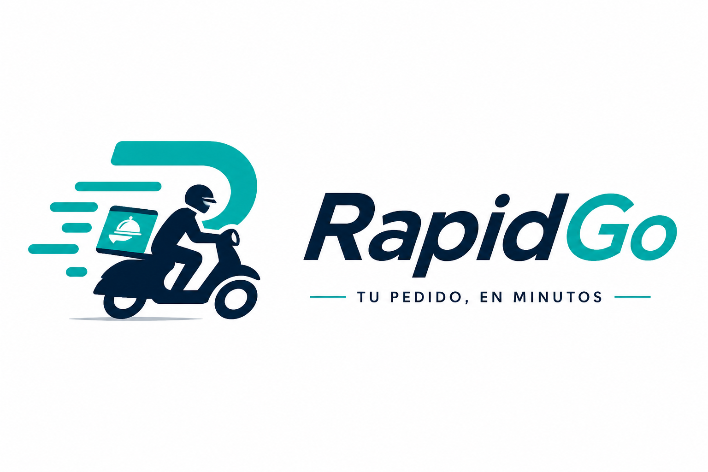
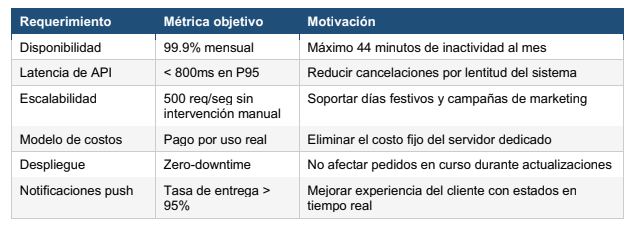
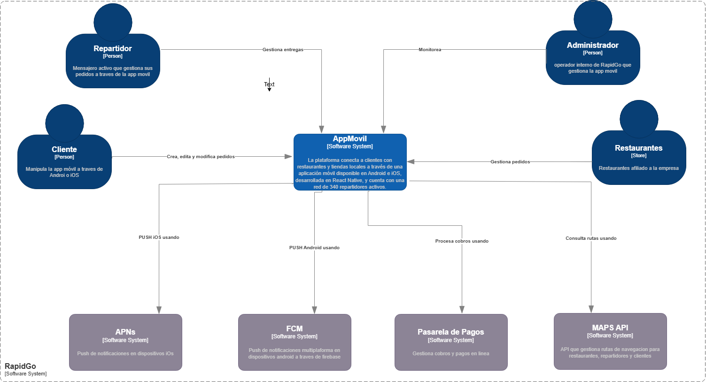
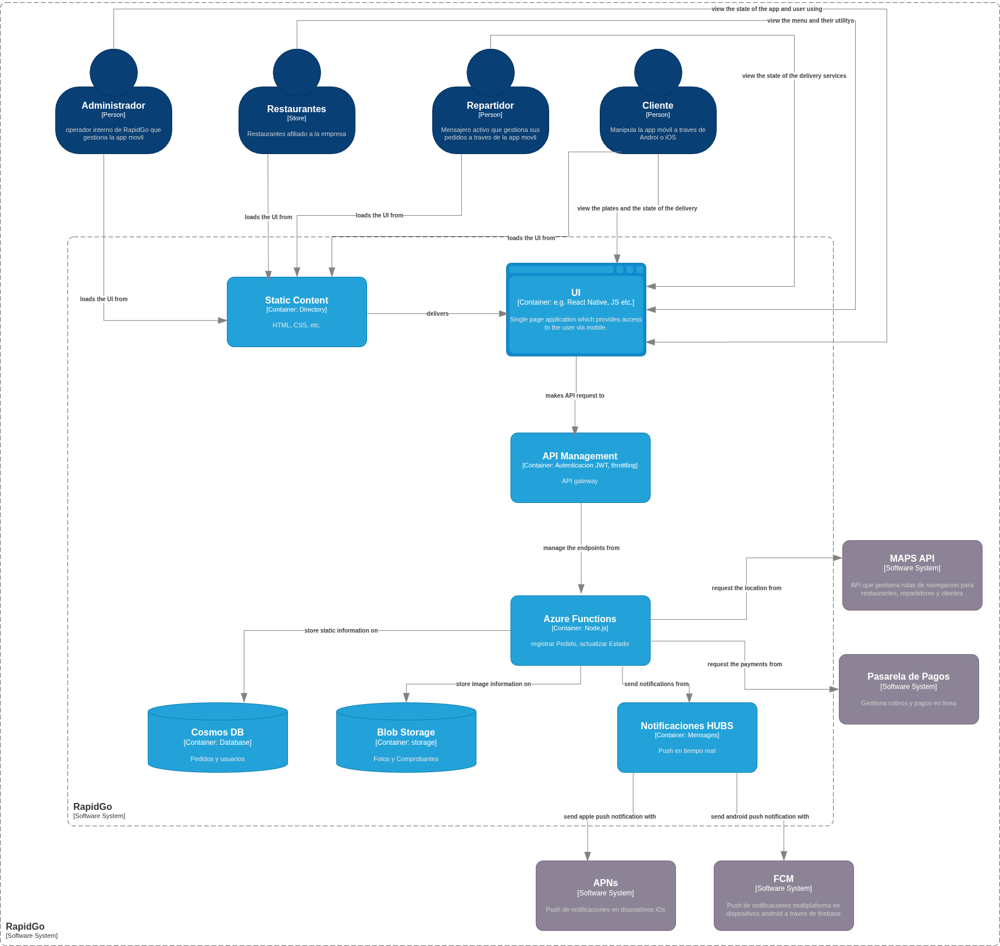
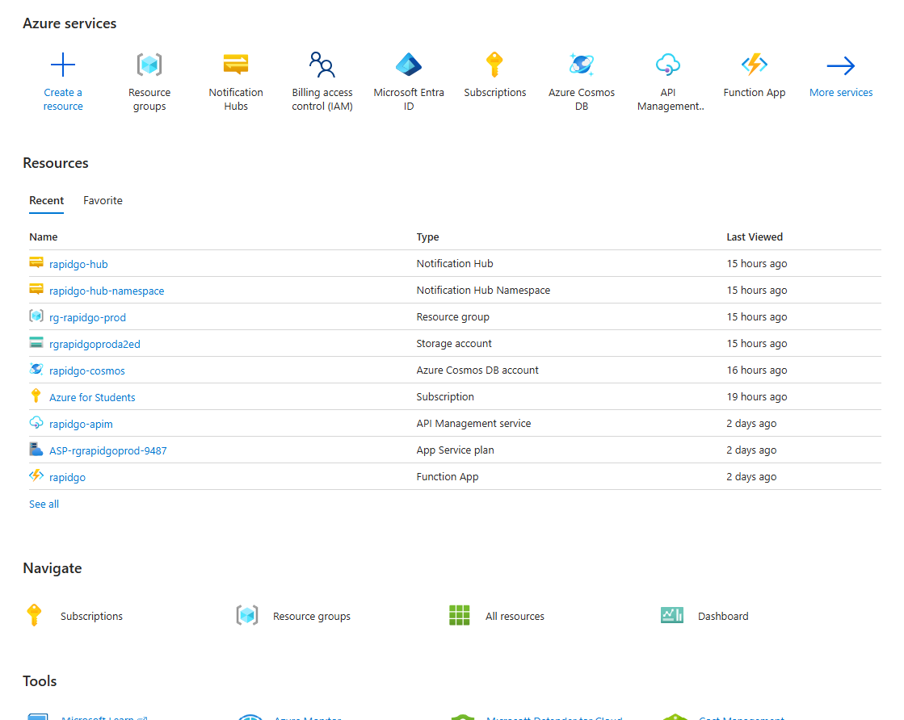
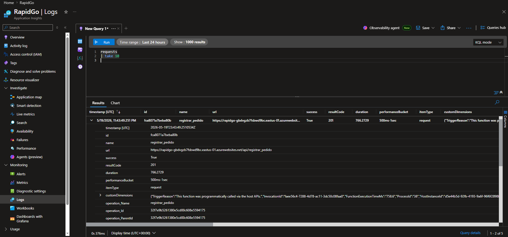
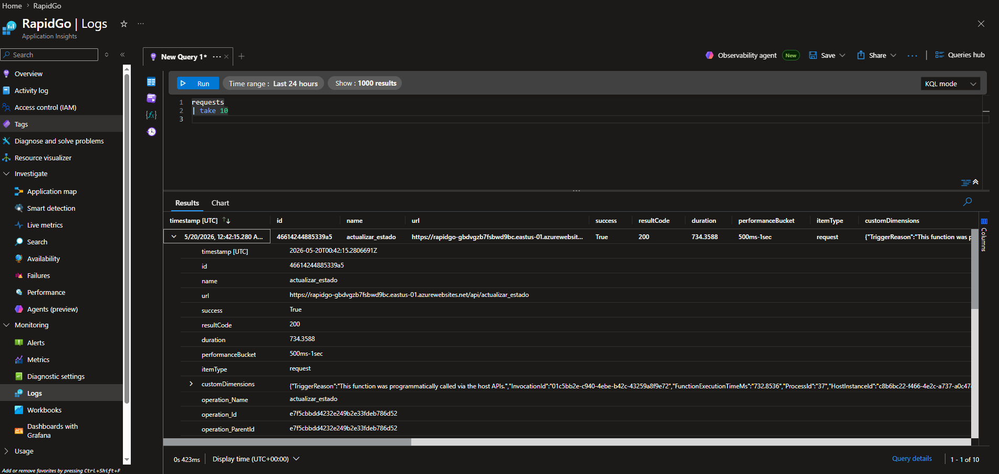
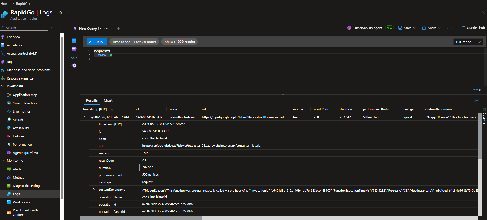
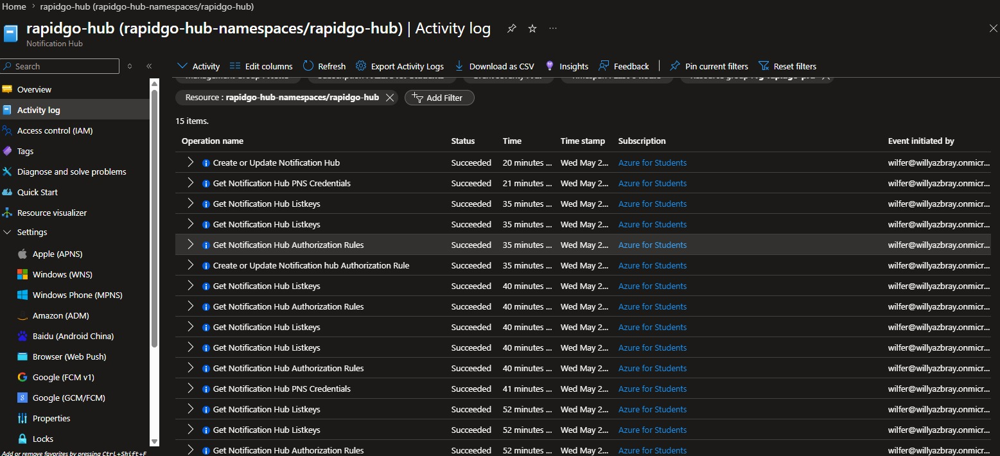
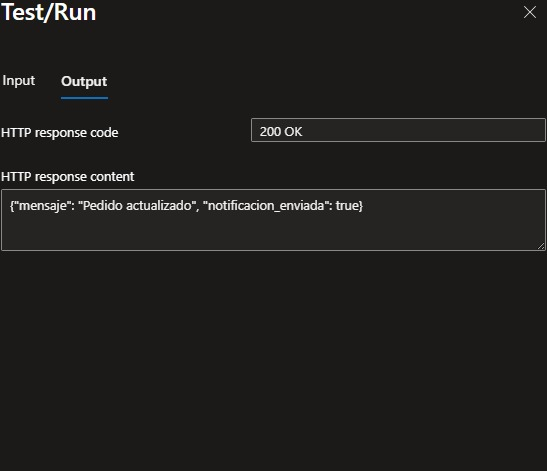

# RapidGo 

  

## Matriz de Control de Cambios

## Indice

1. [Arquitectura](#Arquitectura)
   
## Índice

1. [Contexto del Sistema](#contexto-del-sistema)
   - [Descripción de la empresa](#descripción-de-la-empresa)
   - [Situación tecnológica actual y problemas identificados](#situación-tecnológica-actual-y-problemas-identificados)
   - [Requerimientos para la nueva arquitectura](#requerimientos-para-la-nueva-arquitectura)
   - [Restricciones del proyecto](#restricciones-del-proyecto)

2. [Arquitectura](#arquitectura)
   - [Diagrama C1](#diagrama-c1)
     - [Actores](#actores)
     - [Sistemas](#sistemas)
     - [Interacciones del sistema](#interacciones-del-sistema)
   - [Diagrama C2](#diagrama-c2)
     - [Contenedores del Sistema](#contenedores-del-sistema)
     - [Protocolos de comunicación](#protocolos-de-comunicación)

3. [Grupo de recursos](#grupo-de-recursos)
   - [Azure Functions](#azure-functions)
   - [Azure API Management](#azure-api-management)
   - [Azure Cosmos DB](#azure-cosmos-db)
   - [Azure Storage Account (Blob Storage)](#azure-storage-account-blob-storage)
   - [Azure Notification Hubs](#azure-notification-hubs)

4. [Logs de ejecución Azure Functions](#logs-de-ejecución-azure-functions)
   - [Registrar Pedido](#registrar-pedido)
   - [Actualizar Estado](#actualizar-estado)
   - [Consultar Historial](#consultar-historial)

5. [Notifications Hubs](#notifications-hubs)
   - [Configuración del hub](#configuración-del-hub)
   - [Prueba de notificación](#prueba-de-notificación)

6. [ADR's](#adrs)
   - [ADR-01: Azure Functions vs Azure App Service](#adr-01-uso-de-azure-functions-consumption-plan-sobre-azure-app-service-para-la-lógica-de-negocio-de-rapidgo)
   - [ADR-02: Cosmos DB vs Azure SQL Database](#adr-02-adopción-de-cosmos-db-nosql-en-lugar-de-azure-sql-database-para-persistencia-de-pedidos-usuarios-y-estados-de-entrega)
   - [ADR-03: Azure API Management como gateway](#adr-03-implementación-de-azure-api-management-developer-tier-como-gateway-unificado-para-exponer-las-azure-functions)
   - [ADR-04: Azure Blob Storage vs Azure Files](#adr-04-uso-de-azure-blob-storage-lrs-standard-sobre-azure-files-para-almacenar-comprobantes-de-entrega-imágenes-de-productos-y-reportes)
   - [ADR-05: Azure Notification Hubs vs Azure Communication Services](#adr-05-implementación-de-azure-notification-hubs-free-tier-sobre-azure-communication-services-para-el-envío-de-notificaciones-push-a-clientes-y-repartidores)

## Contexto del Sistema 

### Descripción de la empresa
RapidGo es una startup colombiana de servicios de domicilios fundada en 2022 que opera
actualmente en Medellín, Manizales y Pereira. La plataforma conecta a clientes con
restaurantes y tiendas locales a través de una aplicación móvil disponible en Android e iOS,
desarrollada en React Native, y cuenta con una red de 340 repartidores activos.

En sus primeros dos años de operación, RapidGo procesó en promedio 1.200 pedidos diarios
con picos de hasta 4.500 pedidos en días festivos y fines de semana. Su modelo de negocio
cobra una comisión del 18% por pedido completado, lo que hace que la disponibilidad del
sistema sea directamente proporcional a sus ingresos: cada minuto de caída representa
pérdidas estimadas de $180.000 COP en horas pico.

### Situación tecnológica actual y problemas identificados

El backend actual es una aplicación monolítica en Node.js desplegada en un servidor dedicado
en un datacenter de Medellín. El equipo de tecnología ha documentado los siguientes
problemas críticos que bloquean el crecimiento de la empresa:

• Escalabilidad manual: en horas pico (12m-2pm y 6pm-9pm) el servidor se satura y el
tiempo de respuesta de la API supera los 8 segundos, generando cancelaciones
espontáneas de pedidos estimadas en un 12% del tráfico.

• Costo fijo ineficiente: el servidor dedicado cuesta $4.200.000 COP mensuales
independientemente del tráfico. En horas de baja demanda (2am-8am) el uso de CPU
no supera el 4%, lo que representa un desperdicio significativo de recursos.

• Despliegues con tiempo de inactividad: cualquier actualización del backend requiere 20-
30 minutos de inactividad programada, impactando ventas nocturnas y generando mala
experiencia de usuario.

• Notificaciones no confiables: el sistema actual de push notifications tiene una tasa de
entrega del 67% debido a la falta de integración directa con FCM y APNs, generando
confusión en clientes sobre el estado de sus pedidos.

• Sin tolerancia a fallos: no existe redundancia ni plan de recuperación. Un fallo de
hardware implica caída total del servicio con tiempos históricos de restauración de 2 a 6
horas.

• Deuda técnica en autenticación: el manejo de tokens JWT está implementado de forma
artesanal en el monolito, sin un gateway centralizado, lo que dificulta agregar nuevos
clientes (app web, API pública) en el futuro.

### Requerimientos para la nueva arquitectura

El equipo directivo de RapidGo ha definido los siguientes requerimientos no funcionales que la
nueva arquitectura debe cumplir. El grupo debe verificar en los ADRs que las decisiones
tomadas satisfacen estos requerimientos:

### Restricciones del proyecto

El grupo debe considerar estas restricciones al tomar las decisiones documentadas en los
ADRs. Ignorar una restricción sin justificarlo explícitamente en el ADR correspondiente se
considera un error de diseño:

• El equipo de desarrollo de RapidGo tiene experiencia en Node.js y Python, pero no en
Java ni .NET. Las Functions deben implementarse en uno de estos lenguajes.

• Presupuesto inicial limitado: se deben priorizar servicios con capa gratuita. El gasto
mensual en Azure no debe superar los $50 USD durante la fase piloto.

• La base de datos actual es MySQL relacional con 3 años de datos históricos. Si se
propone un cambio de paradigma (relacional a NoSQL), debe estar explícitamente
justificado en el ADR-02.

• Los datos de usuarios colombianos deben almacenarse en la región Brazil South o East
US por latencia y consideraciones de soberanía de datos.

• La app móvil en React Native no se rediseñará. La nueva API debe mantener
compatibilidad con los contratos de endpoints actuales (mismas rutas y estructura de
respuesta JSON).

• El equipo de infraestructura es de una sola persona. La solución debe minimizar la
carga operativa y evitar servicios que requieran administración manual de servidores o
clusters.

## Arquitectura 

### Diagrama C1

#### Actores

> ##### Cliente
> Es el actor principal del negocio, sin él no hay pedidos ni ingresos. Interactúa con la app para crear, seguir y cancelar pedidos.

> ##### Repartidor
> Actor operativo clave, acepta pedidos y actualiza el estado de la entrega en tiempo real desde la app móvil.

> ##### Administrador
> Actor interno de RapidGo que gestiona la plataforma, monitorea operaciones y administra restaurantes y usuarios.

> ##### Restaurante
> Actor de negocio que publica su catálogo de productos y recibe los pedidos generados por los clientes.

#### Sistemas

> ##### Pasarela de Pagos
> Procesa los cobros realizados a los clientes y comisiones del 18% a repartidores 

> ##### Maps API
> El aplicativo consume un API de navegación para que los repartidores tomen la mejor ruta y calculen el tiempo

> ##### FCM
> Envía notificaciones push Android

> ##### APNS
> Envía notificaciones push iOS

#### Interacciones del sistema

Los clientes utilizan la aplicación móvil para realizar pedidos, modificarlos u eliminarlos, consultar estados y efectuar pagos en línea. Cuando se realiza un pedido, la plataforma coordina automáticamente la interacción con el restaurante encargado de prepararlo y con el repartidor asignado para la entrega.

Para realizar el proceso de entrega, RapidGo consume servicios externos como MAPS API para calcular rutas y tiempos estimados, mientras que las notificaciones en tiempo real son enviadas mediante FCM (Notificaciones PUSH para android atraves de firebase) y APNs (Notificaciones PUSH para Ios) para enviar informacion al cliente sobre la entrega y el repartidor.

Por otra parte, los administradores utilizan la plataforma para supervisar el funcionamiento operativo, monitorear pedidos y gestionar fallas dentro del sistema.

### Diagrama C2

#### Contenedores del Sistema

> ##### Static Content
> Gestions los componentes de la UI

> ##### UI
> Contiene los componentes esenciales del funcionamiento de la app movil 

> ##### API Management
> Punto de entrada único. Gestiona autenticación JWT, throttling por usuario y versionado de la API.
  
> ##### Azure Functions
> Lógica de negocio: registrar pedidos, actualizar estados, consultar historial y disparar notificaciones.
  
> ##### Cosmos DB
> Persistencia de pedidos, usuarios y estados de entrega.
  
> ##### Blob Storage
> Almacenamiento de fotos de comprobantes de entrega, imágenes de productos y reportes.
  
> ##### Notification Hubs
> Envío de notificaciones push en tiempo real a Android (FCM) y iOS (APNs).

#### Protocolos de comunicación

| **From**           | **To**             | **Description**                                                            |
|--------------------|--------------------|----------------------------------------------------------------------------|
| Administrador      | Static Content     | Carga los componentes de la UI                                             |
| Administrador      | UI                 | Ve las interfaces para monitorear la app                                   |
| Restaurantes       | Static Content     | Carga los componentes de la UI                                             |
| Restaurantes       | UI                 | Ve las interfaces para monitorear pedidos y actualizar informacion         |
| Repartidor         | Static Content     | Carga los componentes de la UI                                             |
| Repartidor         | UI                 | Ve las interfaces para monitorear pedidos y ver rutas estimadas de entrega |
| Cliente            | Static Content     | Carga los componentes de la UI                                             |
| Cliente            | UI                 | Ve las interfaces para hacer pedidos, monitorear y ver restaurantes        |
| Static Content     | UI                 | Carga los componentes propuestos en la UI                                  |
| UI                 | API Management     | Hace peticiones a la API                                                   |
| API Management     | Azure Functions    | Administra los endpoints                                                   |
| Azure Functions    | Cosmos DB          | Guarda datos estructurados                                                 |
| Azure Functions    | Blob Storage       | Guarda datos no estructurados                                              |
| Azure Functions    | Pasarela de Pagos  | Hace las peticiones para pagos                                             |
| Azure Functions    | Maps API           | Hace la peticion para cargar mapas y rutas especificas                     |
| Azure Functions    | Notifications HUBS | Maneja el envio de notificaciones a los usuarios                           |
| Notifications HUBS | APN's              | Gestions el envio de notificaciones push a dispositivos Apple              |
| Notifications HUBS | FCM                | Gestions el envio de notificaciones push a dispositivos Android            |

## Grupo de recursos

### Azure Functions

- Se selecciona Azure Functions en plan Flex Consumption porque RapidGo requiere que escale automáticamente de 0 a N instancias según la demanda. Este plan es la evolución moderna del Consumption tier, ofreciendo menor latencia en 'cold starts' y mayor capacidad de escala (hasta 1,000 instancias). La elección de Python 3.13 como runtime permite un desarrollo ágil de la lógica de negocio.

### Azure API Management

- Se implementa API Management como único punto de entrada para la app móvil, desacoplando el cliente de las funciones backend. Esto permite validar tokens JWT centralizadamente, aplicar throttling de 10 peticiones por minuto por usuario (extrayendo el 'sub' del token) para prevenir abuso. El tier Developer se selecciona por incluir todas estas características sin el costo de tiers superiores, siendo adecuado para la fase de desarrollo y pruebas del proyecto.

### Azure Cosmos DB

- La responsabilidad en rapidGo será en la persistencia de pedidos, usuarios y estados de entrega. su modelo de datos sin esquema fijo permite que RapidGo almacene pedidos con atributos variables  La elección de la API NoSQL nativa garantiza integración óptima con Azure Functions mediante bindings. Se activa el Free Tier (1,000 RU/s, 25 GB).

###  Azure Storage Account (Blob Storage)
- Se utiliza la Storage Account (LRS Standard, Hot tier) para almacenar archivos no estructurados: comprobantes de entrega (fotos tomadas por repartidores), imágenes de productos (catalogos de comercios) y reportes operacionales exportados. El acceso público anónimo se mantiene deshabilitado, requiriendo claves de acceso o tokens SAS para garantizar seguridad La redundancia LRS es suficiente para un entorno de desarrollo, y el tier Hot asegura baja latencia para archivos consultados frecuentemente.

### Azure Notification Hubs
- Se implementa Notification Hubs para enviar notificaciones push multiplataforma en tiempo real, informando a los usuarios sobre cambios de estado ('pedido confirmado', 'en camino', 'entregado'). Se selecciona el tier Free (1,000,000 de envíos/mes) por ser suficiente para el volumen esperado en fase de MVP y pruebas. La configuración utiliza FCM v1 para Android (protocolo moderno, no obsoleto) y APNs con autenticación por token para iOS. La integración con Azure Functions permite que, al actualizarse un estado en Cosmos DB, se dispare automáticamente la notificación correspondiente al dispositivo del usuario.

## Logs de ejecución Azure Functions
- RapidGo es una API serverless desplegada en Azure Functions que expone endpoints HTTP para la gestión de pedidos. El servicio se conecta a Azure Application Insights para recopilar telemetría y trazas de solicitudes

### Registrar Pedido
Esta función recibe una solicitud HTTP POST con los datos del pedido y lo registra en el sistema. Una respuesta exitosa devuelve el código 201 Created, indicando que el recurso fue creado correctamente.

### Actualizar Estado
- Esta función recibe una solicitud HTTP PUT con el identificador del pedido y el nuevo estado, y aplica la actualización en el sistema. Una respuesta exitosa devuelve el código 200 OK, confirmando que el recurso fue modificado correctamente.

### Consultar Historial
- Esta función recibe una solicitud HTTP GET y retorna el historial de pedidos. Una respuesta exitosa devuelve el código 200 OK, junto con la lista de registros encontrados en el sistema.

## Notifications Hubs
RapidGo utiliza Azure Notification Hubs para el envío de notificaciones push a los usuarios cuando el estado de un pedido es actualizado.
### Configuración del hub
El hub fue creado y configurado correctamente bajo el namespace rapidgo-hub-namespaces/rapidgo-hub, con soporte para las siguientes plataformas:

- Apple (APNS)

- Google (FCM)

### Prueba de notificación
Al actualizar el estado de un pedido, la función actualizar_estado envía automáticamente una notificación push. El resultado del test confirma que la integración funciona correctamente

## ADR'S 

| Campo         | Contenido |
|---------------|-----------|
| **Título**    | **ADR-01**: Uso de Azure Functions (Consumption Plan) sobre Azure App Service para la lógica de negocio de RapidGo. |
| **Contexto**  | RapidGo necesita escalar automáticamente hasta 500 req/seg en picos (días festivos) sin intervención manual. Actualmente el monolito Node.js se satura en horas pico (12m-2pm, 6pm-9pm) con respuestas >8 segundos y 12% de cancelaciones. El servidor dedicado cuesta $4.200.000 COP/mes fijos, con CPU al 4% en madrugada. Presupuesto piloto <$50 USD/mes, equipo con experiencia en Node.js/Python, infraestructura de una sola persona. |
| **Alternativas evaluadas** | 1) **Azure App Service (Premium/Isolated)** : autoescalado, familiar, zero-downtime, pero costo fijo mensual (>$75 USD) y administración manual. 2) **Azure Functions Consumption Plan**: escala de 0 a N en ms, pago por ejecución (1M gratis/mes), Node.js/Python, zero-downtime. Desventaja: posible cold start. |
| **Decisión**  | Se elige **Azure Functions Consumption Plan**. Cumple escalabilidad automática (500 req/seg), pago por uso (elimina costo fijo), zero-downtime y baja carga operativa. Cold start aceptable para <800ms P95. Alineado con arquitectura de referencia serverless de Microsoft. |

| Campo | Contenido |
|-------|-----------|
| **Título** | **ADR-02**: Adopción de Cosmos DB (NoSQL) en lugar de Azure SQL Database para persistencia de pedidos, usuarios y estados de entrega. |
| **Contexto** | RapidGo actualmente usa MySQL (3 años de datos). Requiere latencia <800ms P95, escalar a 500 req/seg, atributos variables por tipo de negocio. Presupuesto <$50 USD/mes, datos en Brazil South o East US, mínima administración. Se permite cambio de paradigma a NoSQL con justificación. |
| **Alternativas evaluadas** | 1) **Azure SQL Database (Serverless/Basic)**: compatible con MySQL, ACID, free tier 32 GB. Desventajas: escalado horizontal complejo, latencia mayor bajo carga, esquema rígido para atributos variables. 2) **Cosmos DB (Core API)**: escalado horizontal automático (RU/s), latencia <10ms, esquema flexible, free tier 1000 RU/s + 25 GB, Change Feed para notificaciones. Desventaja: cambio de paradigma relacional a documento. |
| **Decisión** | Se elige **Cosmos DB** por su escalabilidad, latencia y flexibilidad de esquema necesarios para cumplir 500 req/seg y <800ms P95. El free tier respeta el presupuesto. Change Feed permite notificaciones confiables. Se justifica el cambio de paradigma por la naturaleza polimórfica de los pedidos y la necesidad de escalar sin intervención manual. |

| Campo | Contenido |
|-------|-----------|
| **Título** | **ADR-03**: Implementación de Azure API Management (Developer tier) como gateway unificado para exponer las Azure Functions. |
| **Contexto** | RapidGo requiere punto único de entrada con autenticación JWT (reemplazar implementación artesanal actual). También necesita throttling por usuario, versionado de API, y compatibilidad con endpoints existentes (mismas rutas/JSON). Carga operativa mínima (equipo de una persona). |
| **Alternativas evaluadas** | 1) **Exposición directa + Easy Auth**: sin costo adicional, pero sin throttling, ni versionado, ni transformación. La gestión JWT quedaría dispersa. 2) **API Management Developer tier**: centraliza JWT, rate limiting, reescritura de URLs, caché, portal de desarrollador. Costo ~$50 USD/mes (dentro del presupuesto). |
| **Decisión** | Se elige **API Management** porque elimina deuda técnica de autenticación. Permite throttling para proteger el consumo de Functions/Cosmos. Facilita compatibilidad backward con endpoints existentes. El costo fijo se compensa con ahorro operativo (una persona administra el gateway). Alineado con arquitectura de referencia Microsoft. |

| Campo | Contenido |
|-------|-----------|
| **Título** | **ADR-04**: Uso de Azure Blob Storage (LRS Standard) sobre Azure Files para almacenar comprobantes de entrega, imágenes de productos y reportes. |
| **Contexto** | RapidGo necesita almacenar fotos (subidas por repartidores), imágenes de productos y exports de reportes. Acceso: escritura única, lectura ocasional desde app móvil o panel admin. Presupuesto bajo, minimizar costos. |
| **Alternativas evaluadas** | 1) **Azure Files (Standard LRS)**: protocolo SMB/NFS, montable como unidad. Más caro por GB (~$0.06 vs $0.02), mayor latencia para app móvil. 2) **Blob Storage (LRS Standard)**: costo menor, URL directa para imágenes, integración con CDN, SAS tokens. Desventaja: no es sistema de archivos montable (acceso vía SDK). |
| **Decisión** | Se elige **Blob Storage** porque el caso de uso principal es almacenar y servir archivos no estructurados a clientes móviles (imágenes). Costo inferior respeta presupuesto piloto. Las Functions usan SDK sin fricción. Servicio estándar en arquitecturas serverless para contenido estático. |

| Campo | Contenido |
|-------|-----------|
| **Título** | **ADR-05**: Implementación de Azure Notification Hubs (Free tier) sobre Azure Communication Services para el envío de notificaciones push a clientes y repartidores. |
| **Contexto** | RapidGo debe mejorar tasa de entrega del 67% actual a >95%, integrando directamente con FCM (Android) y APNs (iOS). Notificaciones por cambio de estado del pedido. Presupuesto piloto limitado, equipo de una persona. |
| **Alternativas evaluadas** | 1) **Azure Communication Services (ACS) – Push**: moderno, SDK unificados, pero sin free tier para push (~$0.005/notificación). Para 1.200 pedidos/día (108.000 notificaciones/mes) excede $50 USD. 2) **Notification Hubs (Free tier)**: 1M notificaciones/mes gratis, manejo automático de registros por plataforma, retries, telemetría. Desventaja: SDKs menos modernos (pero soporta REST). |
| **Decisión** | Se elige **Notification Hubs** porque su free tier se ajusta perfectamente al volumen de RapidGo (108.000 notificaciones/mes), permitiendo cumplir >95% de entrega sin costo adicional. Telemetría integrada ayuda al monitoreo. Es el componente estándar en arquitectura serverless de Microsoft. |

