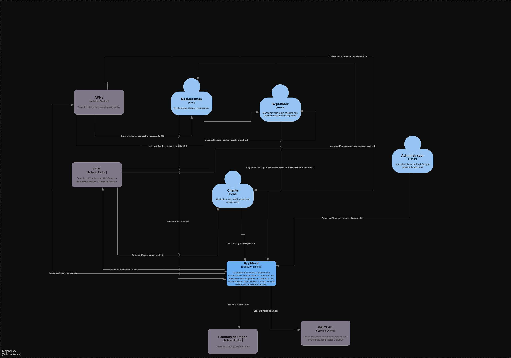

  

# RapidGo Backend

Backend serverless para la aplicación móvil de servicios de domicilios RapidGo.
Reemplaza una arquitectura monolítica con alta saturación en horas pico y sin
tolerancia ante fallos por un sistema distribuido construido sobre Microsoft Azure,
permitiendo escalabilidad automática a más de 500 solicitudes por segundo sin
intervención manual y un modelo de costos basado en consumo real.

## Stack de Servicios AZURE

- Azure Functions: Lógica de negocio y procesamiento de pedidos
- Azure API Management: Punto de entrada único, autenticación JWT y throttling
- Azure Cosmos DB: Persistencia de pedidos, usuarios y estados de entrega
- Azure Blob Storage: Almacenamiento de comprobantes e imágenes de productos
- Azure Notification Hubs: Notificaciones push a Android (FCM) e iOS (APNs)

## Arquitectura

### Contexto del Sistema

RapidGo opera en Medellín, Manizales y Pereira con una red de 340 repartidores
activos. El sistema procesa en promedio 1.200 pedidos diarios con picos de hasta
4.500 en días festivos. La arquitectura serverless elimina el costo fijo de
infraestructura y garantiza disponibilidad del 99.9% mensual.

## Diagrama C1

### Usuarios/Actores

- Cliente — es el actor principal del negocio, sin él no hay pedidos ni ingresos. Interactúa con la app para crear, seguir y cancelar pedidos.
- Repartidor — actor operativo clave, acepta pedidos y actualiza el estado de la entrega en tiempo real desde la app móvil.
- Administrador — actor interno de RapidGo que gestiona la plataforma, monitorea operaciones y administra restaurantes y usuarios.
- Restaurante/Tienda — actor de negocio que publica su catálogo de productos y recibe los pedidos generados por los clientes.

### Sistemas externos

- FCM — Firebase Cloud Messaging, necesario para enviar notificaciones push a dispositivos Android. Es el estándar de Google para este propósito.
- APNs — Apple Push Notification Service, equivalente de FCM pero para dispositivos iOS. Sin él no hay notificaciones en iPhone.
- Pasarela de pagos — Es el modelo de negocio de RapidGo encargado de realizar cobros a clientes por pedido y separar comision del 18% a los repartidores por pedido completado.
- Maps API — Los repartidores necesitan navegación para las rutas de entrega y los clientes necesitan ver el seguimiento en tiempo real.
