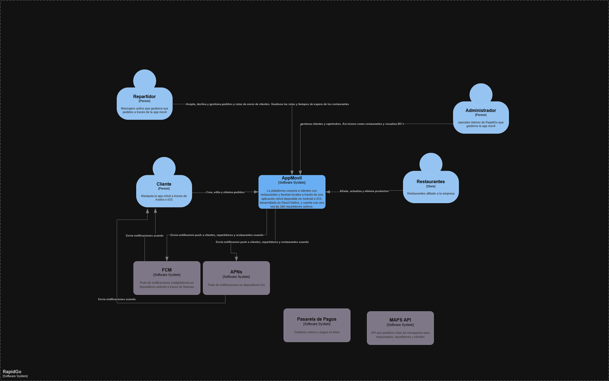

# RapidGo Backend

Backend serverless para la aplicación móvil de servicios de domicilios RapidGo.
Reemplaza una arquitectura monolítica con alta saturación en horas pico y sin
tolerancia ante fallos por un sistema distribuido construido sobre Microsoft Azure,
permitiendo escalabilidad automática a más de 500 solicitudes por segundo sin
intervención manual y un modelo de costos basado en consumo real.

## Stack de Servicios AZURE 
Azure Functions: Lógica de negocio y procesamiento de pedidos 
Azure API Management: Punto de entrada único, autenticación JWT y throttling 
Azure Cosmos DB: Persistencia de pedidos, usuarios y estados de entrega 
Azure Blob Storage: Almacenamiento de comprobantes e imágenes de productos 
Azure Notification Hubs: Notificaciones push a Android (FCM) e iOS (APNs) 

## Arquitectura
### Contexto del Sistema
RapidGo opera en Medellín, Manizales y Pereira con una red de 340 repartidores
activos. El sistema procesa en promedio 1.200 pedidos diarios con picos de hasta
4.500 en días festivos. La arquitectura serverless elimina el costo fijo de
infraestructura y garantiza disponibilidad del 99.9% mensual.

## Diagrama C1

