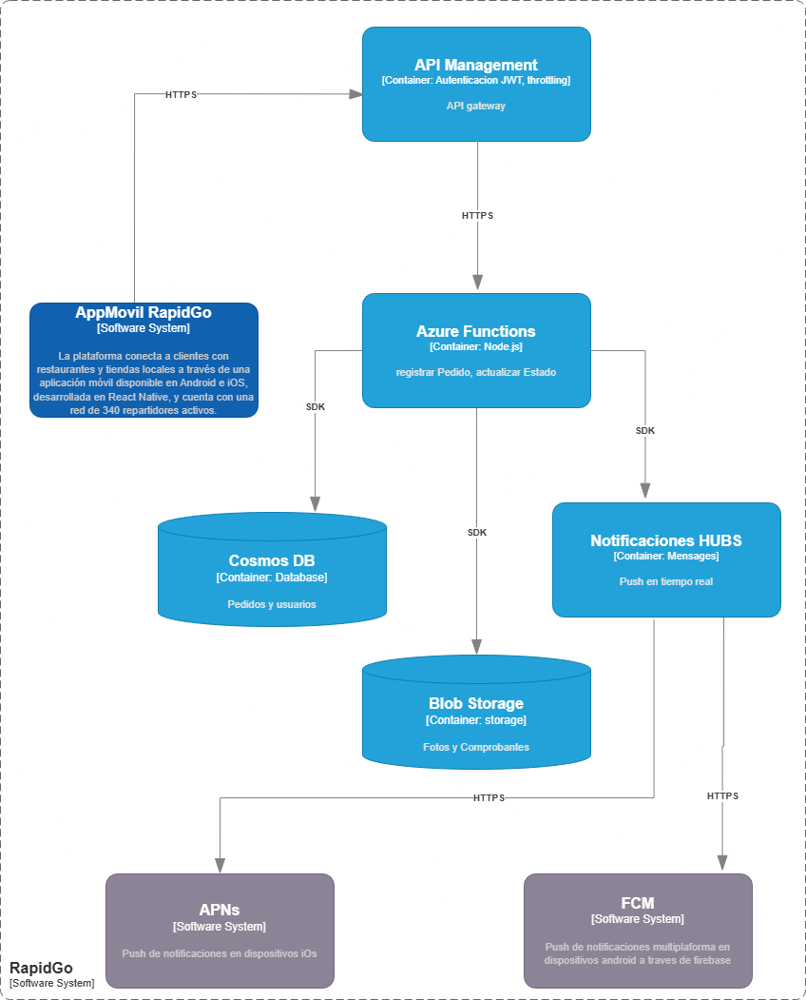

# RapidGo 

  

## Matriz de Control de Cambios

## Indice

## Arquitectura

## Contexto del Sistema

### Descripción de la empresa
RapidGo es una startup colombiana de servicios de domicilios fundada en 2022 que opera
actualmente en Medellín, Manizales y Pereira. La plataforma conecta a clientes con
restaurantes y tiendas locales a través de una aplicación móvil disponible en Android e iOS,
desarrollada en React Native, y cuenta con una red de 340 repartidores activos.

En sus primeros dos años de operación, RapidGo procesó en promedio 1.200 pedidos diarios
con picos de hasta 4.500 pedidos en días festivos y fines de semana. Su modelo de negocio
cobra una comisión del 18% por pedido completado, lo que hace que la disponibilidad del
sistema sea directamente proporcional a sus ingresos: cada minuto de caída representa
pérdidas estimadas de $180.000 COP en horas pico.

### Situación tecnológica actual y problemas identificados

El backend actual es una aplicación monolítica en Node.js desplegada en un servidor dedicado
en un datacenter de Medellín. El equipo de tecnología ha documentado los siguientes
problemas críticos que bloquean el crecimiento de la empresa:

• Escalabilidad manual: en horas pico (12m-2pm y 6pm-9pm) el servidor se satura y el
tiempo de respuesta de la API supera los 8 segundos, generando cancelaciones
espontáneas de pedidos estimadas en un 12% del tráfico.

• Costo fijo ineficiente: el servidor dedicado cuesta $4.200.000 COP mensuales
independientemente del tráfico. En horas de baja demanda (2am-8am) el uso de CPU
no supera el 4%, lo que representa un desperdicio significativo de recursos.

• Despliegues con tiempo de inactividad: cualquier actualización del backend requiere 20-
30 minutos de inactividad programada, impactando ventas nocturnas y generando mala
experiencia de usuario.

• Notificaciones no confiables: el sistema actual de push notifications tiene una tasa de
entrega del 67% debido a la falta de integración directa con FCM y APNs, generando
confusión en clientes sobre el estado de sus pedidos.

• Sin tolerancia a fallos: no existe redundancia ni plan de recuperación. Un fallo de
hardware implica caída total del servicio con tiempos históricos de restauración de 2 a 6
horas.

• Deuda técnica en autenticación: el manejo de tokens JWT está implementado de forma
artesanal en el monolito, sin un gateway centralizado, lo que dificulta agregar nuevos
clientes (app web, API pública) en el futuro.

### Requerimientos para la nueva arquitectura

El equipo directivo de RapidGo ha definido los siguientes requerimientos no funcionales que la
nueva arquitectura debe cumplir. El grupo debe verificar en los ADRs que las decisiones
tomadas satisfacen estos requerimientos:

### Restricciones del proyecto

El grupo debe considerar estas restricciones al tomar las decisiones documentadas en los
ADRs. Ignorar una restricción sin justificarlo explícitamente en el ADR correspondiente se
considera un error de diseño:

• El equipo de desarrollo de RapidGo tiene experiencia en Node.js y Python, pero no en
Java ni .NET. Las Functions deben implementarse en uno de estos lenguajes.

• Presupuesto inicial limitado: se deben priorizar servicios con capa gratuita. El gasto
mensual en Azure no debe superar los $50 USD durante la fase piloto.

• La base de datos actual es MySQL relacional con 3 años de datos históricos. Si se
propone un cambio de paradigma (relacional a NoSQL), debe estar explícitamente
justificado en el ADR-02.

• Los datos de usuarios colombianos deben almacenarse en la región Brazil South o East
US por latencia y consideraciones de soberanía de datos.

• La app móvil en React Native no se rediseñará. La nueva API debe mantener
compatibilidad con los contratos de endpoints actuales (mismas rutas y estructura de
respuesta JSON).

• El equipo de infraestructura es de una sola persona. La solución debe minimizar la
carga operativa y evitar servicios que requieran administración manual de servidores o
clusters.

## Diagrama C1

### Usuarios/Actores

- Cliente — es el actor principal del negocio, sin él no hay pedidos ni ingresos. Interactúa con la app para crear, seguir y cancelar pedidos.
- Repartidor — actor operativo clave, acepta pedidos y actualiza el estado de la entrega en tiempo real desde la app móvil.
- Administrador — actor interno de RapidGo que gestiona la plataforma, monitorea operaciones y administra restaurantes y usuarios.
- Restaurante/Tienda — actor de negocio que publica su catálogo de productos y recibe los pedidos generados por los clientes.

### Sistemas externos

- FCM — Firebase Cloud Messaging, necesario para enviar notificaciones push a dispositivos Android. Es el estándar de Google para este propósito.
- APNs — Apple Push Notification Service, equivalente de FCM pero para dispositivos iOS. Sin él no hay notificaciones en iPhone.
- Pasarela de pagos — Es el modelo de negocio de RapidGo encargado de realizar cobros a clientes por pedido y separar comision del 18% a los repartidores por pedido completado.
- Maps API — Los repartidores necesitan navegación para las rutas de entrega y los clientes necesitan ver el seguimiento en tiempo real.

### Interacciones del sistema

#### Actores → AppMovil

- Cliente → AppMovil | Crea, edita y elimina pedidos: El cliente es el actor principal del negocio. Sin él no hay pedidos ni ingresos para RapidGo 
- Repartidor → AppMovil | Asigna y notifica pedidos: El repartidor gestiona sus entregas y rutas directamente desde la app móvil 
- Administrador → AppMovil | Reporta métricas y estado de la operación: El administrador supervisa clientes, repartidores y restaurantes desde un único punto 
- Restaurante → AppMovil | Gestiona su catálogo: El restaurante añade, actualiza y elimina productos para que los clientes puedan ordenar 

#### AppMovil → Sistemas externos

- AppMovil → Pasarela de Pagos | Procesa cobros online: RapidGo cobra una comisión del 18% por pedido completado, lo que hace indispensable un sistema de cobro en línea 
- AppMovil → Maps API | Consulta rutas dinámicas: Los repartidores necesitan navegación para las entregas y los clientes necesitan ver el seguimiento de su pedido en tiempo real 
- AppMovil → FCM | Envía notificaciones push Android: FCM es el estándar de Google para notificaciones en dispositivos Android, necesario para informar cambios de estado del pedido
- AppMovil → APNs | Envía notificaciones push iOS: APNs es el servicio de Apple equivalente a FCM, indispensable para notificaciones en dispositivos iPhone

## Diagrama C2

#### Contenedores del Sistema

- API Management: Punto de entrada único. Gestiona autenticación JWT, throttling por usuario y versionado de la API
  
- Azure Functions: Lógica de negocio: registrar pedidos, actualizar estados, consultar historial y disparar notificaciones
  
- Cosmos DB: Persistencia de pedidos, usuarios y estados de entrega
  
- Blob Storage: Almacenamiento de fotos de comprobantes de entrega, imágenes de productos y reportes
  
- Notification Hubs: Envío de notificaciones push en tiempo real a Android (FCM) y iOS (APNs) 

#### Protocolos de comunicación

- AppMóvil RapidGo → API Management | HTTPS | Todas las peticiones REST de la app móvil ingresan por este punto
  
- API Management → Azure Functions | HTTPS : El gateway enruta las peticiones validadas hacia las funciones correspondientes

- Azure Functions → Cosmos DB | SDK de Cosmos DB:  Lectura y escritura de pedidos y usuarios usando el SDK oficial de Azure
  
- Azure Functions → Blob Storage | SDK de Azure Storage:  Almacenamiento de fotos de 
comprobantes de entrega, imágenes de productos y exportes de reportes operacionales 
  
- Azure Functions → Notification Hubs | SDK de Notification Hubs:  Disparo de notificaciones push al cambiar el estado de un pedido
   
- Notification Hubs → APNs | HTTPS: Entrega de notificaciones push a dispositivos iOS
  
- Notification Hubs → FCM | HTTPS: Entrega de notificaciones push a dispositivos Android vía Firebase 
